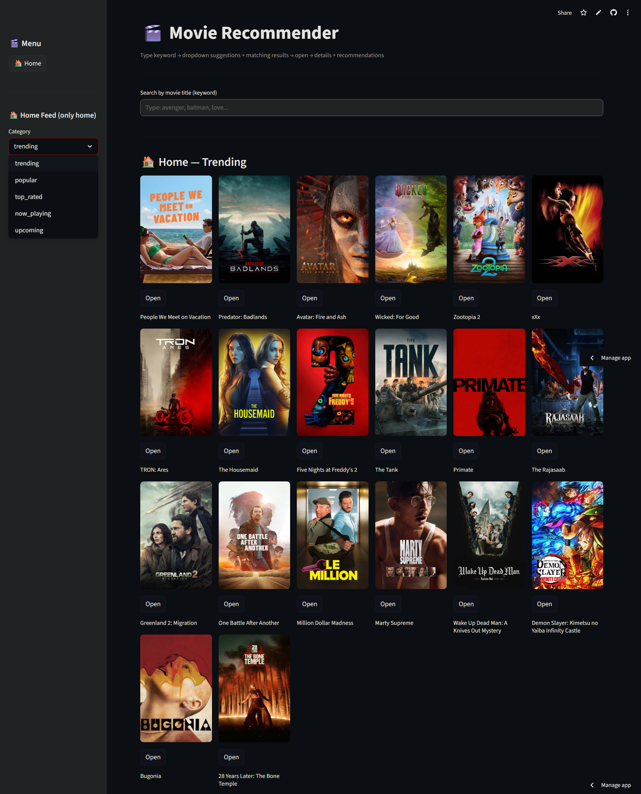

# Movie Recommendation System

A full-stack movie recommendation application that combines:

- A FastAPI backend for content-based recommendation APIs
- A Streamlit frontend for an interactive movie discovery UI
- TMDB (The Movie Database) integration for real-time movie metadata, posters, and details

This project supports keyword search, detailed movie pages, and recommendation flows powered by precomputed TF-IDF similarity data.

## Features

- Search movies using TMDB
- View movie details (poster, overview, release date, genres)
- Get related recommendations using TF-IDF similarity
- Explore category-based home feed (trending, popular, top rated, now playing, upcoming)
- Responsive card grid UI in Streamlit

## Tech Stack

- Python
- FastAPI
- Streamlit
- scikit-learn (TF-IDF and similarity workflow)
- Pandas and NumPy
- TMDB API

## Project Structure

- `main.py`: FastAPI backend with recommendation and TMDB helper endpoints
- `app.py`: Streamlit frontend (search, cards, details, navigation)
- `requirements.txt`: Python dependencies
- `df.pkl`, `indices.pkl`, `tfidf.pkl`, `tfidf_matrix.pkl`: precomputed recommendation artifacts
- `preview/`: screenshots used in this README

## How Recommendation Works

1. Movie metadata is transformed into TF-IDF vectors.
2. The backend loads precomputed matrices from pickle files.
3. When a movie is selected, cosine similarity is used to rank similar movies.
4. The backend enriches recommendations with live TMDB metadata.
5. The frontend renders recommendation cards and details.

## Prerequisites

- Python 3.10+ recommended
- A TMDB API key

## Setup and Run (Local)

### 1. Clone repository

```bash
git clone https://github.com/dhruvv16-hash/Movie-Recommondation.git
cd Movie-Recommondation
```

### 2. Create virtual environment

```bash
python -m venv .venv
```

Windows PowerShell:

```powershell
.\.venv\Scripts\Activate.ps1
```

macOS/Linux:

```bash
source .venv/bin/activate
```

### 3. Install dependencies

```bash
pip install -r requirements.txt
```

### 4. Configure environment variables

Create a `.env` file in the project root:

```env
TMDB_API_KEY=your_tmdb_api_key_here
```

### 5. Run backend (FastAPI)

```bash
uvicorn main:app --host 127.0.0.1 --port 8000 --reload
```

Backend will be available at:

- API root: `http://127.0.0.1:8000`
- Swagger docs: `http://127.0.0.1:8000/docs`

### 6. Run frontend (Streamlit)

Open a second terminal (same virtual environment) and run:

```bash
streamlit run app.py
```

Frontend will be available at:

- `http://localhost:8501`

## API Base URL Note

In `app.py`, `API_BASE` currently points to a deployed Render backend first and then falls back to local URL expression:

```python
API_BASE = "https://movie-rec-466x.onrender.com" or "http://127.0.0.1:8000"
```

Because non-empty strings are always truthy in Python, this always uses the Render URL. If you want to use local backend during development, change `API_BASE` to:

```python
API_BASE = "http://127.0.0.1:8000"
```

## Screenshots

## Screen Recording

### Full App Walkthrough

<video src="MOVIE%20RECOM.mp4" controls width="900" preload="metadata"></video>

If the embedded player does not load on your GitHub view, use the preview below:

[](MOVIE%20RECOM.mp4)

### Home Page


### Search Results and Recommendations



## Troubleshooting

- `TMDB_API_KEY missing`: ensure `.env` exists and contains a valid API key.
- CORS or connection issues: make sure backend is running and `API_BASE` points to the correct URL.
- Missing artifacts (`*.pkl`): ensure all model files are present in root.

## Future Improvements

- Better ranking strategy combining TF-IDF and popularity/ratings
- User personalization and watchlist support
- Docker setup for one-command local start
- CI pipeline with tests and lint checks

## Author

Dhruv Vira

## License

This project is for educational and portfolio use.
